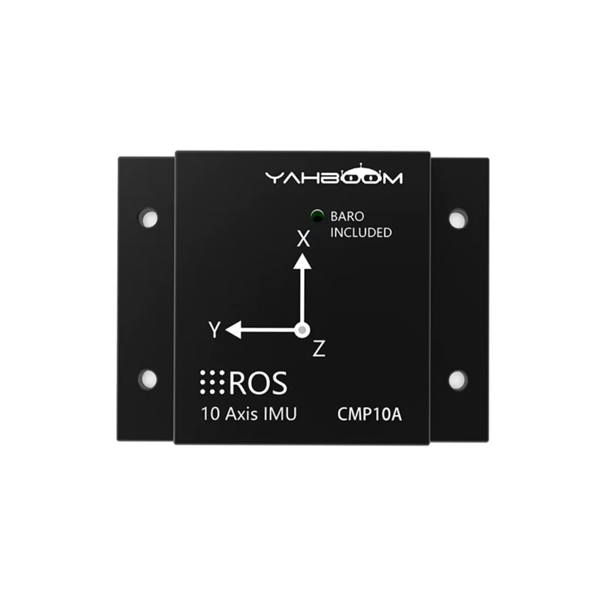

# IMU_ROS2_CMP10A
The nine-axis ARHS attitude sensor MEMS magnetometer bought from yahboom performs well in ROS1, but when it is used in ROS2, the data of a number of sensors will tend to zero indefinitely and the data will float in chaos. The warehouse has rewritten the driver code of the Yahnboom IMU CMP10A. So that it can read the data correctly in ROS2 Humble/Jazzy.
<p align="center">
  
</p>

## Use IMU_Driver
```bash
$ . install/setup.bash
$ ros2 launch gnss_imu_sim imu_driver_launch.py
```
